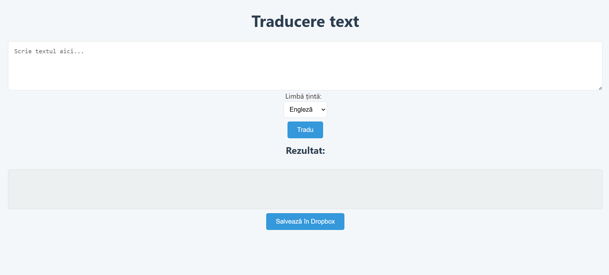
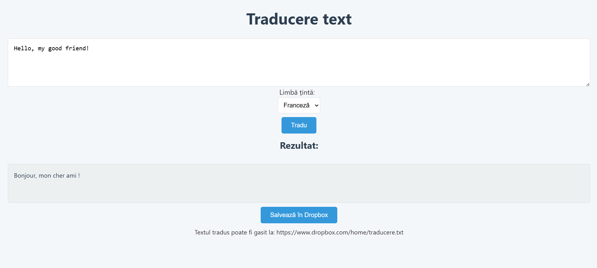

# Translator App - Traducere și Salvare în Cloud

**Autor:** Pascaru Cristian 
**Grupa:** 1134

---

## 1. Introducere

Această aplicație web permite utilizatorilor să traducă texte în diferite limbi folosind serviciul DeepL API și să salveze textele traduse în contul de Dropbox, utilizând API-ul Dropbox. Aplicația este dezvoltată folosind Node.js, Express și HTML+JavaScript pentru frontend.

---

## 2. Descriere problemă (0,25p)

Utilizatorii au nevoie de o soluție simplă pentru a traduce rapid texte între limbi multiple și pentru a păstra o arhivă a traducerilor într-un spațiu de stocare sigur și accesibil online. Această aplicație răspunde acestei nevoi prin combinarea a două servicii cloud: DeepL pentru traducere și Dropbox pentru stocare.

---

## 3. Descriere API (0,25p)

Aplicația oferă două endpoint-uri REST principale:

- `POST /translate`  
  Primește un text și o limbă țintă, și returnează textul tradus folosind API-ul DeepL.

- `POST /upload`  
  Primește un nume de fișier și conținut, și salvează fișierul în Dropbox prin API-ul Dropbox.

Autentificarea pentru aceste servicii se face prin token-uri API stocate în variabile de mediu (`DEEPL_API_KEY` și `DROPBOX_TOKEN`).

---

## 4. Flux de date (0,25p)

- Clientul trimite un request POST către `/translate` cu un JSON care conține textul și limba țintă.  
- Serverul primește requestul, apelează DeepL API pentru traducere și returnează textul tradus în răspuns JSON.  
- Clientul poate apoi trimite un request POST către `/upload` cu numele fișierului și textul tradus pentru a fi salvat în Dropbox.  
- Serverul primește datele și folosește API-ul Dropbox pentru a crea/actualiza fișierul.

### Exemple request/response

**POST /translate**  
Request body:
```json
{
  "text": "Salut, lume!",
  "lang": "EN"
}
```

Response:
```json
{
  "translatedText": "Hello, world!"
}
```

**POST /upload**  
Request body:
```json
{
  "filename": "traducere.txt",
  "content": "Hello, world!"
}
```

Response:
```json
{
  "url": "https://www.dropbox.com/s/xxxxxx/traducere.txt?dl=0"
}
```

### Metode HTTP utilizate

- POST pentru traducere și upload

### Autentificare

- Se folosesc tokenuri API stocate în variabile de mediu, fără expunere în codul sursă.

---

## 5. Capturi ecran aplicație (0,25p)

  
*Interfața aplicației, cu câmp pentru text, selecție limbă, buton traducere și buton salvare în Dropbox.*

  
*Exemplu de rezultat afișat după traducere.*

---

## 6. Referințe

- [DeepL API Documentation](https://www.deepl.com/docs-api)  
- [Dropbox API Documentation](https://www.dropbox.com/developers/documentation/http/documentation)  
- [Express.js](https://expressjs.com/)  
- [Node.js](https://nodejs.org/)

---

## Bonus: Cum să rulezi proiectul local

1. Clonează repo-ul  
2. Rulează `npm install`  
3. Creează fișier `.env` cu următorul conținut:
```
DEEPL_API_KEY=your_deepl_key  
DROPBOX_TOKEN=your_dropbox_token
```
4. Pornește serverul:
```
node index.js
```
5. Accesează în browser:
```
http://localhost:3000
```
